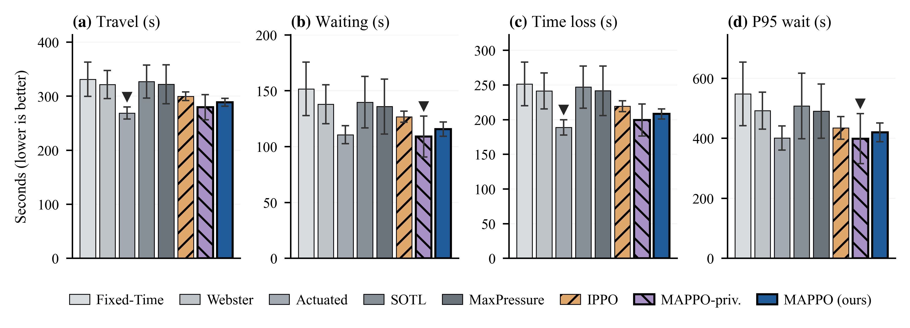
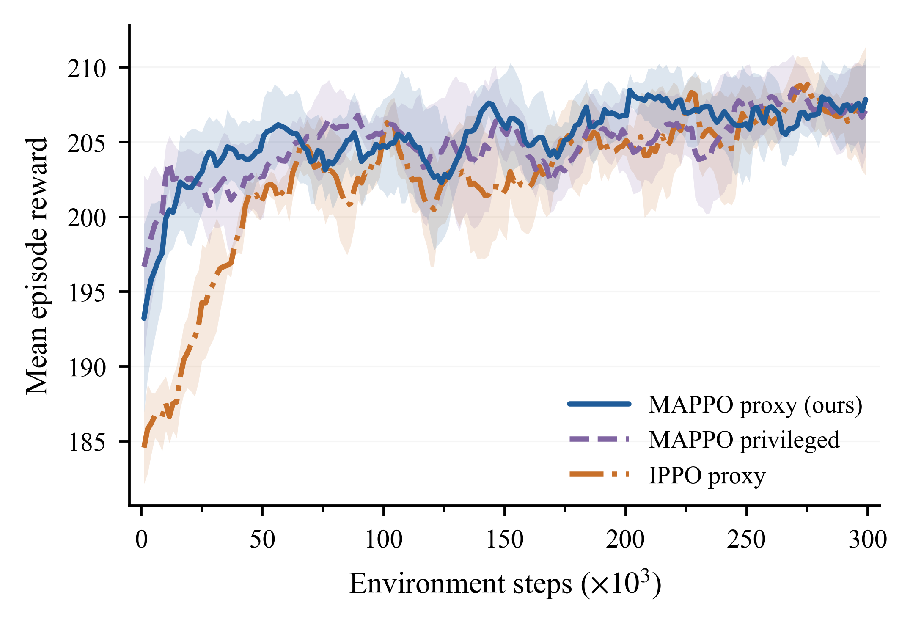

<div align="center">

# 🚦 Camera-Observable MAPPO for Traffic Signal Control

### Multi-Agent Reinforcement Learning that Learns to Control Traffic Signals from Signals a Camera Can Actually See

[-b31b1b?style=for-the-badge)](#-citation)
[](LICENSE)
[](https://www.python.org/)
[](https://sumo.dlr.de/)
[-7c3aed?style=for-the-badge)](https://arxiv.org/abs/2103.01955)

[Overview](#-overview) · [Contributions](#-contributions) · [Results](#-results) · [Method](#-method) · [Install](#-installation) · [Usage](#-usage) · [Docs](#-documentation) · [Cite](#-citation)

</div>

---

## 📖 Overview

Deep reinforcement learning reaches strong results on traffic signal control (TSC) **in
simulation**, but the policies rarely survive contact with a real intersection. The reason is
usually not the driving dynamics — it is the **observations**. Simulators such as SUMO hand the
agent *privileged* state that no roadside sensor can measure: exact per-lane queue lengths,
per-vehicle waiting timers, network-wide throughput counts. Train on those and the policy learns
to depend on signals that simply do not exist at deployment.

This repository studies that **observation-space sim-to-real gap** head-on. It trains a
decentralized [MAPPO](https://arxiv.org/abs/2103.01955) controller in SUMO whose **every
observation feature and every reward term is computable from a single roadside camera**
(YOLO detections + ByteTrack trajectories), and benchmarks it against strong classical and
instrumented baselines under motorcycle-dominant mixed traffic.

> This repository is the code behind **Paper 1**, *Camera-Observable MAPPO for Traffic Signal
> Control* (under review at **IEEE T-ITS**, 2026). The real-time hardware deployment
> (cameras → policy → controller) is a companion *System* paper; its runtime code lives under
> `src/` but is not exercised by any result here.

---

## ✨ Contributions

- **C1 — Observation-space alignment.** Every one of the 26 per-agent features has a documented
  vision proxy computable from detections and tracks — see [`docs/state.md`](docs/state.md).
- **C2 — Camera-computable reward.** A six-term PRESSLIGHT-extended reward (nonlinear queue
  penalty, *signed* pressure, cooperative throughput, switch / low-speed / waiting penalties)
  with **zero privileged exception** — see [`docs/reward.md`](docs/reward.md).
- **C3 — Quantified restriction cost.** A privileged-observation upper bound isolates the price
  of the camera-only constraint: only **≈3%** mean travel time on the grid, i.e. the camera
  feature set retains **≈97%** of the task-relevant information.
- **C4 — Mixed-traffic realism.** Sub-lane SUMO calibrated to Vietnamese composition
  (73% motorcycle count share), with composition, demand, and lane-model generalization sweeps.

---

## 📊 Results

Main comparison on the **N3 grid (4×4, 16 agents)** under a time-varying peak-demand profile,
5 training seeds × 5 held-out route-seeds (mean travel time, seconds; lower is better). MAPPO is
the **best camera-deployable controller on every metric**, trailing only the loop-instrumented
references that a camera-only stack is designed to replace.

<div align="center">



</div>

| Method | Travel (s) ↓ | Waiting (s) ↓ | P95 waiting (s) ↓ | Trips ↑ |
|---|:--:|:--:|:--:|:--:|
| Fixed-time | 331.3 | 151.7 | 547.5 | 14 596 |
| Webster | 321.6 | 137.9 | 492.1 | 14 631 |
| Max-pressure | 322.0 | 135.9 | 490.2 | 14 703 |
| SOTL | 327.1 | 139.8 | 507.5 | 14 677 |
| IPPO | 299.8 | 126.8 | 434.6 | 14 608 |
| **MAPPO (ours)** | **288.5** | **115.6** | **419.9** | **14 721** |
| *SUMO-actuated (instrumented ref.)* | *268.8* | *110.7* | *400.7* | *14 888* |
| *MAPPO-privileged (upper bound)* | *279.7* | *108.9* | *398.8* | *14 724* |

- **≈10–13%** lower mean travel time than every camera-deployable classical baseline (large
  effect sizes; at *n* = 5 seeds not individually Holm-significant — effect sizes, not p-values,
  are treated as the evidence).
- **≈3%** restriction cost vs. the privileged upper bound (retains ≈97% of its performance).
- On the **N2 corridor** the ranking reverses: a single-axis arterial already sits near its
  instrumented ceiling, so the queue-centric objective adds no headroom — a boundary of the
  objective family, analyzed as a *topology-dependence* result in the paper.

<div align="center">



</div>

---

## 🧠 Method

**One decentralized MAPPO agent per intersection**, centralized-critic / decentralized-actor
(CTDE): the critic sees the global state during training, the actors act on a local 26-dim
observation at execution.

**Observation (26-dim per agent).** Four approaches × five features
(`effective_queue_norm`, `occupancy_norm`, `avg_speed_norm`, `motorbike_share`,
`heavy_vehicle_share`) + six signal features (`phase_one_hot[0..3]`, `green_timer_norm`,
signed `pressure_norm`). Full source ↔ vision-proxy table in [`docs/state.md`](docs/state.md).

**Reward (revision 1.2.0).** `mean(q²)` queue penalty (anti-starvation), *signed* pressure,
local lane-exit throughput, plus switch / low-speed / waiting penalties — all camera-computable.
Full derivation in [`docs/reward.md`](docs/reward.md).

**Algorithm.** MAPPO with per-agent value heads, a parameter-shared actor, per-agent GAE
(γ = 0.99, λ = 0.95), PPO clip 0.2, Welford observation normalization saved in every checkpoint.
An IPPO variant (independent critics on local obs) isolates the CTDE contribution.

---

## 🛠 Installation

```bash
git clone https://github.com/tronghia256-EdgeAI/Sim2Real-MAPPO-Traffic.git
cd Sim2Real-MAPPO-Traffic

python -m venv .venv
source .venv/bin/activate          # Windows: .venv\Scripts\activate
pip install -r requirements.txt
```

**SUMO** (required for training/evaluation) must be installed separately and `SUMO_HOME` set:

```bash
# Ubuntu/Debian: sudo apt-get install sumo sumo-tools
# macOS:         brew install sumo
# Windows:       https://sumo.dlr.de/docs/Downloads.php
export SUMO_HOME=/usr/share/sumo   # Windows: $env:SUMO_HOME = "C:\Program Files (x86)\Eclipse\Sumo"
```

### Tested environment

The reported results were produced with the following stack. `requirements.txt` carries looser
floors; the exact versions below are the known-good reference.

| Component | Version | | Component | Version |
|---|---|---|---|---|
| Python | 3.10.9 | | PyTorch | 2.11.0 (CPU) |
| SUMO | 1.24.0 | | NumPy / SciPy | 1.26.4 / 1.15.3 |
| OS | Windows 11 (26200) | | Gymnasium / PettingZoo | 1.2.3 / 1.25.0 |
| Ultralytics / OpenCV | 8.4.39 / 4.13.0 | | pandas / Matplotlib | 2.2.3 / 3.10.3 |

Training and evaluation are CPU-only; no GPU is required.

---

## 🚀 Usage

Run everything from the project root.

```bash
# Train MAPPO on the N3 grid (time-varying demand)
python experiment/runners/train_ppo.py \
  --sumo-cfg    sumo_configs/networks/n3_grid/sumo_config.sumocfg \
  --lane-groups sumo_configs/networks/n3_grid/lane_groups.json \
  --seed 42 --total-timesteps 300000

# IPPO ablation (independent critics on local obs)
python experiment/runners/train_ppo.py --algo ippo  ...same flags...

# Canonical multi-seed comparison (95% CI + Mann-Whitney/Holm + Cohen's d)
python experiment/runners/eval_compare.py \
  --network n3_grid --checkpoint "models/paper1_mappo/ckpts_clean/old_main/<run>/best_model.pt" \
  --methods mappo webster actuated maxpressure sotl fixed --seeds 42 123 456 789 1337

# Classical baselines standalone
python experiment/baselines/webster.py  --network n3_grid --seed 42
python experiment/baselines/actuated.py --network n3_grid --seed 42

# Verify observation consistency, then run the test suite
python scripts/check_obs_match.py
pytest -m "not slow and not serial"
```

Trained checkpoints under `models/` are gitignored (bulk artifacts): train first with the
command above, or point `--checkpoint` at your own run directory. The full campaign → tables →
figures pipeline is documented in [`docs/reproduction.md`](docs/reproduction.md) (turnkey via
`scripts/build_paper_artifacts.py`).

---

## 📁 Repository Layout

```
.
├── src/traffic_env/          # SUMO env, 26-dim observations, 6-term reward, config (training truth)
│   └── ...                    # src/ is a shared library; policy_loader + vision proxy live here too
├── experiment/
│   ├── runners/              # train_ppo, eval_compare (canonical table harness)
│   ├── baselines/            # webster, actuated, max_pressure, sotl
│   ├── ablation/ · plots/    # reward/obs ablations, multi-seed figures
│   ├── calibration/          # sensing-noise calibration from detector statistics
│   └── common/tripinfo.py    # shared travel/waiting/P95/CO2 parser
├── scripts/                  # generate_networks · generate_demand · generate_ood_scenarios
│                             # parallel_launcher · build_paper_artifacts · check_obs_match
├── sumo_configs/
│   ├── networks/{n2_corridor,n3_grid}/   # topology + lane_groups.json
│   └── evaluation/{low,medium,high,asymmetric}/
├── configs/                  # state_config.json (obs schema) · noise_config.json
├── results/paper1_mappo/     # eval tables, noise sweeps, pilots (paper-cited artifacts)
├── models/paper1_mappo/      # trained checkpoints (bulk, local backup — gitignored)
├── figures/                  # publication-ready figures (PDF/PNG/SVG)
├── docs/                     # state.md · reward.md · reproduction.md · README (index)
└── tests/ · requirements.txt · pytest.ini · CITATION.cff · LICENSE
```

---

## 📚 Documentation

| Document | What it covers |
|---|---|
| [`docs/state.md`](docs/state.md) | The 26-dim observation — every feature, SUMO source, vision proxy, alignment |
| [`docs/reward.md`](docs/reward.md) | The six-term reward (rev. 1.2.0): equation, derivation, weights |
| [`docs/reproduction.md`](docs/reproduction.md) | Campaign → tables → figures, end to end |

---

## 🔖 Citation

If you use this work, please cite the paper (currently **under review**):

```bibtex
@article{trongnghia2026_camera_mappo,
  author  = {Le, Trong Nghia and Nguyen, Thien Bao},
  title   = {{Camera-Observable MAPPO for Traffic Signal Control}},
  journal = {IEEE Transactions on Intelligent Transportation Systems},
  year    = {2026},
  note    = {Under review}
}
```

<details>
<summary>Software / repository citation</summary>

```bibtex
@software{sim2real_mappo_traffic_2026,
  author    = {Le, Trong Nghia and Nguyen, Thien Bao},
  title     = {{Camera-Observable MAPPO for Traffic Signal Control}},
  year      = {2026},
  publisher = {GitHub},
  url       = {https://github.com/tronghia256-EdgeAI/Sim2Real-MAPPO-Traffic},
  license   = {MIT}
}
```
</details>

Machine-readable metadata is in [`CITATION.cff`](CITATION.cff) (GitHub's "Cite this repository").

---

## 📖 References

1. **PressLight** — Wei et al., *Learning Max-Pressure Control to Coordinate Traffic Signals*, KDD 2019.
2. **Max Pressure** — Varaiya, *Max-Pressure Control of a Network of Signalized Intersections*, TR-C 2013.
3. **MAPPO** — Yu et al., *The Surprising Effectiveness of PPO in Cooperative Multi-Agent Games*, NeurIPS 2022.
4. **SUMO** — Lopez et al., *Microscopic Traffic Simulation using SUMO*, IEEE ITSC 2018.
5. **YOLOv11** — Jocher et al., *Ultralytics YOLO11*, 2024. · **ByteTrack** — Zhang et al., ECCV 2022.

---

## 📄 License

Released under the **MIT License** — see [LICENSE](LICENSE).
